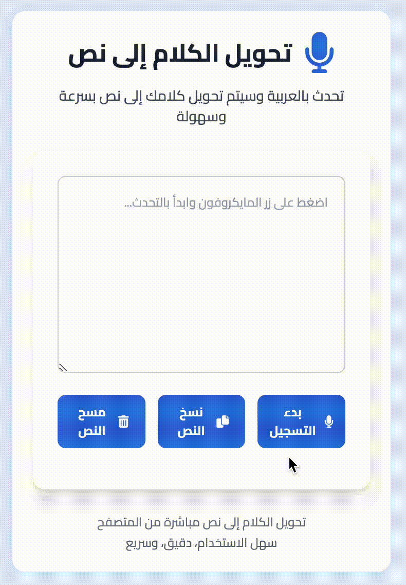

# 🎙️ Arabic Speech to Text Chrome Extension

## Overview
A modern, user-friendly Chrome extension that converts Arabic speech to text directly in your browser with a sleek, intuitive interface.

## 🌟 Features
- 🔊 Real-time Arabic speech recognition
- 📋 Easy text copying
- 🎨 Modern, responsive design
- 🌐 Works directly in the browser

## 📦 Installation

### Chrome Web Store
[Coming Soon]

### Manual Installation
1. Clone the repository
2. Open Chrome and go to `chrome://extensions/`
3. Enable "Developer mode"
4. Click "Load unpacked" and select the extension directory

## 🚀 Usage
1. Click the extension icon
2. Grant microphone permissions
3. Start speaking in Arabic
4. Watch your speech convert to text instantly!

## 🛠 Technologies
- HTML5
- Tailwind CSS
- JavaScript
- Web Speech API

## 🤝 Contributing
Contributions are welcome! Please follow these steps:
1. Fork the repository
2. Create your feature branch (`git checkout -b feature/AmazingFeature`)
3. Commit your changes (`git commit -m 'Add some AmazingFeature'`)
4. Push to the branch (`git push origin feature/AmazingFeature`)
5. Open a Pull Request

## 📝 License
Distributed under the MIT License. See `LICENSE` for more information.

## 🙌 Acknowledgments
- [Web Speech API](https://developer.mozilla.org/en-US/docs/Web/API/Web_Speech_API)
- [Tailwind CSS](https://tailwindcss.com/)
- Font Awesome Icons

---

Made with ❤️ for Arabic speakers by [@Devehab](https://github.com/Devehab)

